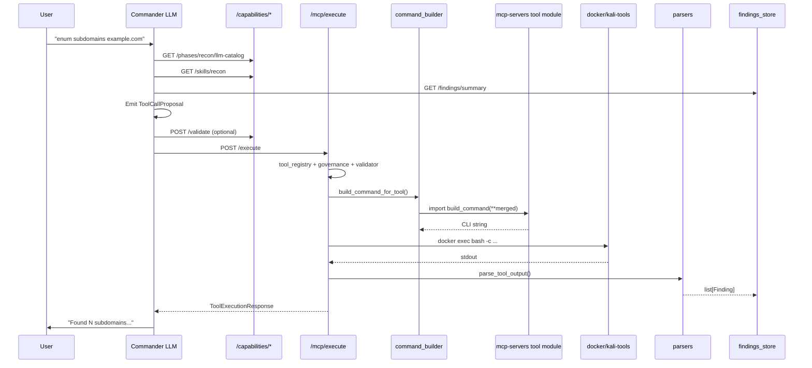

# Tools Layer — Detailed Analysis & End-to-End Execution Guide

> **Project:** `new work/AI-Pentesting-Tool/`  
> **Scope:** Recon + network tools layer (Governed Agentic Execution model)  
> **Status:** Tools/execution/skills/findings **done** · Commander LLM/chat **not done** (friend's scope)  
> **Related docs:** `[LLM_INTEGRATION.md](./LLM_INTEGRATION.md)` · `[analysis.md](../analysis.md)` · `[Tool_architecture.md](../Tool_architecture.md)`

---

## Table of Contents

1. [Executive Summary](#1-executive-summary)
2. [Problem This Layer Solves](#2-problem-this-layer-solves)
3. [Design Philosophy: Governed Agentic Execution](#3-design-philosophy-governed-agentic-execution)
4. [Architecture Overview](#4-architecture-overview)
5. [Layer-by-Layer Deep Dive](#5-layer-by-layer-deep-dive)
6. [Complete File Inventory](#6-complete-file-inventory)
7. [The Three Registries](#7-the-three-registries)
8. [Data Models Explained](#8-data-models-explained)
9. [Free-Form Flags: How the LLM Adds Any CLI Flag](#9-free-form-flags-how-the-llm-adds-any-cli-flag)
10. [End-to-End Walkthrough:](#10-end-to-end-walkthrough-subfinder_scan) `subfinder_scan`
11. [Second Example:](#11-second-example-nmap_service_scan-with-custom-flags) `nmap_service_scan` [with Custom Flags](#11-second-example-nmap_service_scan-with-custom-flags)
12. [Execution Paths: Docker vs MCP Stdio](#12-execution-paths-docker-vs-mcp-stdio)
13. [Governance Pipeline](#13-governance-pipeline)
14. [Findings Pipeline](#14-findings-pipeline)
15. [Skills System](#15-skills-system)
16. [API Reference](#16-api-reference)
17. [Typical Demo Chain (Recon → Network)](#17-typical-demo-chain-recon--network)
18. [Division of Labor](#18-division-of-labor)
19. [Comparison: Shannon vs Dark-Moon vs This Platform](#19-comparison-shannon-vs-dark-moon-vs-this-platform)
20. [Known Gaps & Future Work](#20-known-gaps--future-work)
21. [Appendix: Task & Tool Inventory](#21-appendix-task--tool-inventory)

---


## 1. Executive Summary

This implementation adds a **structured bridge** between an LLM Commander (your friend builds this) and **90 HexStrike-harvested security tools** running on a Kali VM. The LLM never outputs raw shell commands. Instead it emits a `ToolCallProposal` — a JSON object with `tool_name`, typed `params`, and unrestricted `additional_args`.

The platform then:

1. **Validates** the proposal (shell-injection block only — no flag whitelist)
2. **Builds** the CLI by dynamically importing each tool's harvested `build_command()` from `mcp-servers/`
3. **Executes** inside the `kali-tools` Docker container via `docker exec`
4. **Parses** stdout into structured `Finding` objects
5. **Stores** findings for the next agent turn

**Key design decision:** Examples in YAML and skills are **hints**, not allowlists. The LLM can pass any flag it knows (e.g. `-recursive` on subfinder) via `additional_args`, even if that flag is never mentioned in the config.

---


## 2. Problem This Layer Solves


### Before


| Issue                                                             | Impact                                                            |
| ----------------------------------------------------------------- | ----------------------------------------------------------------- |
| Dual command builders (`tool_runner.py` vs harvested MCP modules) | Wrong CLI for complex tools; drift between registry and execution |
| No LLM contract                                                   | Model might emit raw shell; no validation boundary                |
| 90 tools exposed at once                                          | Context overload; poor tool selection                             |
| No findings memory                                                | Each turn starts from scratch                                     |
| No task/skill layer                                               | No methodology guidance for recon vs network phases               |


### After


| Solution                                                     | File(s)                                              |
| ------------------------------------------------------------ | ---------------------------------------------------- |
| Single `command_builder` imports harvested `build_command()` | `services/command_builder.py`                        |
| `ToolCallProposal` schema — structured, never raw shell      | `schemas/tool_call.py`                               |
| Task-based catalog (8 tasks, ~24 tools in recon+network)     | `config/recon_network_tools.yaml`                    |
| Skills markdown for methodology                              | `skills/recon/`, `skills/network/`, `skills/shared/` |
| In-memory findings + parsers                                 | `findings_store.py`, `parsers/recon_network.py`      |
| Capabilities API for LLM setup                               | `api/v1/endpoints/capabilities.py`                   |


---


## 3. Design Philosophy: Governed Agentic Execution

**Governed Agentic Execution (GAE)** means:

- **Agentic:** The LLM chooses tools, params, and flags based on findings and skills — not a fixed script.
- **Governed:** Every call passes scope/safety checks (`governance.py`), structured validation (`param_validator.py`), and audit logging (`audit_log.py`).
- **Execution backend:** The 90 HexStrike tools are the *hands*; the Commander is the *brain*. The brain does not need all 90 tools in its function-calling schema at once — it works through **tasks** (subdomain enum, port discovery, etc.).


### What we borrowed


| Source        | What we took                                                                                                            |
| ------------- | ----------------------------------------------------------------------------------------------------------------------- |
| **Shannon**   | Finding confidence levels (`confirmed` / `likely` / `hypothesis`); governance before execution; structured deliverables |
| **Dark-Moon** | Exploration freedom — LLM picks tools and flags; workflows suggest patterns, not rigid checklists                       |
| **Strix**     | Skills as markdown methodology injected into prompts                                                                    |
| **HexStrike** | Harvested `build_command()` per tool; `IntelligentErrorHandler` in `_core/runner.py` (available on MCP stdio path)      |


---


## 4. Architecture Overview

```
┌─────────────────────────────────────────────────────────────────────────┐
│                     FRIEND BUILDS (not implemented)                      │
│  User → POST /agent/chat → Commander LLM (LiteLLM) → ToolCallProposal   │
└───────────────────────────────────┬─────────────────────────────────────┘
                                    │
        ┌───────────────────────────┼───────────────────────────┐
        ▼                           ▼                           ▼
 GET /capabilities/          GET /capabilities/           GET /findings/
 llm-catalog                 skills/{phase}               summary
        │                           │                           │
        └───────────────────────────┼───────────────────────────┘
                                    ▼
                    POST /capabilities/validate (optional)
                    POST /capabilities/build-command (optional)
                                    ▼
                         POST /mcp/execute
                                    │
        ┌───────────────────────────┼───────────────────────────┐
        ▼                           ▼                           ▼
 tool_registry.py            governance.py              param_validator.py
 (does tool exist?)          (scope/safety?)            (shell chars only)
        │                           │                           │
        └───────────────────────────┼───────────────────────────┘
                                    ▼
                         command_builder.py
                    (merge params + additional_args)
                                    │
                                    ▼
              mcp-servers/{category}/tools/{tool}.py
                         build_command(**params)
                                    │
                                    ▼
                         mcp_client.py
              docker exec -i kali-tools bash -c "..."
                                    │
                                    ▼
                         summary_agent.py
                    parsers/recon_network.py
                                    │
                                    ▼
                         findings_store.py
                    (memory for next LLM turn)
```


### Mermaid: request lifecycle




---


## 5. Layer-by-Layer Deep Dive


### 5.1 Schema layer — contracts between LLM and platform

Schemas define **what shape data must have** at each boundary. They do not contain business logic.


| Schema                     | Purpose                                                   |
| -------------------------- | --------------------------------------------------------- |
| `ToolCallProposal`         | LLM output: tool name, params, free-form flags, reasoning |
| `ToolCallValidationResult` | Validator output: approved/denied + normalized params     |
| `ToolExecutionRequest`     | HTTP body for `/mcp/execute`                              |
| `ToolExecutionResponse`    | HTTP response: stdout, stderr, command, success           |
| `Finding`                  | Structured observation for agent memory                   |
| `ToolCapability`           | LLM-facing tool metadata (params, hints, examples)        |
| `TaskDefinition`           | High-level task (e.g. subdomain_enumeration)              |


### 5.2 Config layer — tasks and LLM hints

`config/recon_network_tools.yaml` defines:

- **8 tasks** mapping intent → default tool + alternatives + skill file
- **24 tool entries** (9 recon + 15 network) with parameters, `llm_hints`, `example_calls`
- `freeform_args_field` per tool (`additional_args`, `extra_args`, or `flags` for nmap)

This file is **not** the execution source of truth for CLI building. Execution uses harvested Python modules. YAML is for **LLM context**.

### 5.3 Registry layer — two complementary registries

1. `tool_registry.py` — All 90 tools: name, category, safety, MCP server, executable, base parameters. Required for governance and existence checks.
2. `task_registry.py` — Loads YAML, merges with registry, exposes `llm_tool_catalog_for_phase()`.


### 5.4 Execution layer — command building and running

1. `param_validator.py` — Blocks shell metacharacters only.
2. `command_builder.py` — Merges LLM flags, imports `build_command()` from disk.
3. `mcp_client.py` — Runs command in Kali container (docker exec) or via MCP stdio.


### 5.5 Intelligence layer — post-processing

1. `parsers/recon_network.py` — Deterministic stdout → `Finding` list.
2. `summary_agent.py` — Orchestrates parse + store after successful run.
3. `findings_store.py` — In-memory store + text summary for prompts.


### 5.6 API layer — HTTP surface for Commander


| Router            | Prefix                 | Role                                     |
| ----------------- | ---------------------- | ---------------------------------------- |
| `capabilities.py` | `/api/v1/capabilities` | Catalog, skills, validate, build preview |
| `mcp.py`          | `/api/v1/mcp`          | Execute tools                            |
| `findings.py`     | `/api/v1/findings`     | List/summary/create findings             |
| `agent.py`        | `/api/v1/agent`        | **Stub** — friend implements chat loop   |


Registered in `api/v1/router.py`.

---


## 6. Complete File Inventory


### New files (tools layer)

```
backend/src/pentest_platform/
├── schemas/
│   ├── tool_call.py              # ToolCallProposal, ToolCallValidationResult
│   ├── finding.py                # Finding, FindingType, FindingConfidence
│   └── tool_capability.py        # TaskDefinition, ToolCapability
├── services/
│   ├── command_builder.py        # Single CLI builder (imports harvested modules)
│   ├── param_validator.py        # Permissive validation
│   ├── task_registry.py          # YAML loader + LLM catalog
│   ├── skills_loader.py          # Markdown skills for prompts
│   ├── findings_store.py         # In-memory findings
│   ├── summary_agent.py          # Post-run parse orchestration
│   └── parsers/
│       ├── __init__.py
│       └── recon_network.py      # subfinder, httpx, nmap, rustscan parsers
└── api/v1/endpoints/
    ├── capabilities.py           # Catalog + validate + build-command
    └── findings.py               # Findings CRUD + summary

config/
└── recon_network_tools.yaml      # Tasks + tool capabilities for LLM

skills/
├── recon/
│   ├── phase-overview.md
│   ├── subdomain-enumeration.md
│   ├── live-host-probing.md
│   ├── historical-url-discovery.md
│   ├── web-crawling.md
│   └── dns-intelligence.md
├── network/
│   ├── phase-overview.md
│   ├── port-scan-strategy.md
│   ├── service-enumeration.md
│   └── smb-enumeration.md
└── shared/
    ├── finding-confidence.md
    ├── governance-rules.md
    └── tool-selection-ux.md

docs/
├── LLM_INTEGRATION.md            # Handoff for Commander developer
└── TOOLS_LAYER_ANALYSIS.md       # This document
```


### Modified files


| File                        | Change                                                                         |
| --------------------------- | ------------------------------------------------------------------------------ |
| `schemas/tools.py`          | Added `additional_args`, `run_id`, `record_findings` to `ToolExecutionRequest` |
| `services/tool_registry.py` | Added `additional_args` to `_COMMON_PARAMS` for all 90 tools                   |
| `services/mcp_client.py`    | Docker exec path uses `command_builder` instead of `tool_runner`               |
| `api/v1/endpoints/mcp.py`   | Validate → build preview → execute → summarize findings                        |
| `api/v1/router.py`          | Registered `capabilities` and `findings` routers                               |


### Unchanged but critical at runtime

```
mcp-servers/
├── _core/
│   ├── runner.py                 # run_tool() with cache + error recovery
│   ├── executor.py               # Tokenised command execution
│   ├── error_handler.py          # HexStrike IntelligentErrorHandler
│   └── cache.py
├── recon/
│   ├── server.py                 # FastMCP server (stdio path)
│   └── tools/
│       ├── subfinder_scan.py     # build_command() — execution truth
│       ├── amass_scan.py
│       └── ... (7 more recon tools)
└── network/
    ├── server.py
    └── tools/
        ├── rustscan_fast_scan.py
        ├── nmap_tools.py / nmap wrappers
        └── ... (15 network tools)
```

---


## 7. The Three Registries

Understanding where tool metadata lives is essential. There are **three sources** that must stay name-aligned:

### 7.1 `tool_registry.py` — canonical tool list (90 tools)

Hardcoded `ToolDefinition` objects. Used for:

- "Does this tool exist?"
- Governance (safety level, category)
- MCP server routing (`mcp_server` field)
- Base parameter definitions

Example entry for subfinder:

```python
_t("subfinder_scan", ToolCategory.RECON, "subfinder", ToolSafetyLevel.PASSIVE,
   "Passive subdomain enumeration across public data sources.",
   ["subdomains", "osint", "asset-discovery"],
   {"domain": _p("", "Target domain"), **_COMMON_PARAMS}),
```

`_COMMON_PARAMS` now includes:

```python
"additional_args": _p("", "Free-form CLI flags — LLM may pass any valid flags not listed above.")
```


### 7.2 `config/recon_network_tools.yaml` — LLM-facing catalog

Adds task mapping, hints, examples, `freeform_args_field`. Used for:

- `GET /capabilities/phases/recon/llm-catalog`
- Function-calling schema generation
- Skill file references

**Important:** `example_calls` like `{ domain: "example.com", additional_args: "-all" }` are **suggestions**. The LLM is explicitly told it may pass flags not in examples.

### 7.3 `mcp-servers/{category}/tools/{tool_name}.py` — execution truth

Each harvested module exports:


| Function                  | Role                                                       |
| ------------------------- | ---------------------------------------------------------- |
| `build_command(**params)` | Assembles CLI string from typed params + `additional_args` |
| `run(...)`                | Full path via `_core.runner.run_tool()` (cache, recovery)  |
| `parse(result)`           | Optional structured parse inside MCP layer                 |


`command_builder.py` dynamically imports `build_command` — **no duplicate logic in the backend**.

---


## 8. Data Models Explained


### 8.1 `ToolCallProposal` (LLM → platform)

```python
class ToolCallProposal(BaseModel):
    tool_name: str           # Registry name, e.g. "subfinder_scan"
    reasoning: str           # Why this tool now (for UX/audit)
    params: dict[str, Any]   # Typed params: domain, target, ports, etc.
    additional_args: str     # ANY extra CLI flags — not whitelisted
    task: str | None         # Optional: "subdomain_enumeration"
    based_on_findings: list[str]  # Finding IDs this call pivots from
```


### 8.2 `ToolExecutionRequest` (HTTP → `/mcp/execute`)

```python
class ToolExecutionRequest(BaseModel):
    tool_name: str
    params: dict[str, str | int | bool | None]
    engagement_id: str | None      # Links to scope/RoE
    run_id: str | None             # Groups findings per agent run
    timeout: int = 300
    use_recovery: bool = True      # Passed to MCP runner (stdio path)
    use_cache: bool = True
    additional_args: str = ""      # Top-level free-form flags
    record_findings: bool = True   # Auto-parse stdout after success
```


### 8.3 `Finding` (platform → LLM memory)

```python
class Finding(BaseModel):
    id: str                        # Short hex ID for based_on_findings refs
    engagement_id: str
    run_id: str
    phase: str                     # "recon" | "network"
    finding_type: FindingType      # subdomain, url, port, service, ...
    title: str                     # e.g. "api.example.com"
    description: str
    evidence: str                  # Raw stdout line snippet
    confidence: FindingConfidence    # confirmed | likely | hypothesis
    source_tool: str
    target: str
    metadata: dict
    created_at: datetime
```


### 8.4 `ToolCapability` (catalog → LLM)

```python
class ToolCapability(BaseModel):
    tool_name: str
    task: str
    phase: str
    safety_level: ToolSafetyLevel
    executable: str
    description: str
    parameters: dict[str, ParamSpec]
    freeform_args_field: str       # "additional_args" | "extra_args" | "flags"
    llm_hints: str
    example_calls: list[dict]
```

---


## 9. Free-Form Flags: How the LLM Adds Any CLI Flag


### 9.1 Design principle

**We do not maintain a flag allowlist per tool.** The LLM's training knowledge of subfinder/nmap/httpx flags is the source of truth. The platform only prevents **shell injection**.

### 9.2 Where flags can arrive


| Source                                 | Example                                      |
| -------------------------------------- | -------------------------------------------- |
| `ToolCallProposal.additional_args`     | `"-recursive -timeout 30"`                   |
| `params.additional_args`               | Same, nested in params                       |
| `params.extra_args`                    | Used by nmap tools in YAML                   |
| `params.flags`                         | Full nmap flag string for `nmap_custom_scan` |
| `ToolExecutionRequest.additional_args` | Top-level on execute API                     |


All paths merge in `merge_llm_params()`:

```python
def merge_llm_params(params, additional_args="", *, freeform_field="additional_args"):
    """Merge typed params with free-form LLM flags. No flag whitelist."""
    # 1. Strip internal keys (use_recovery, use_cache, exec_timeout)
    # 2. Collect additional_args from top-level + param aliases
    # 3. Write combined string into freeform_field
    # 4. Return merged dict → passed to harvested build_command()
```


### 9.3 What gets blocked

Regex: `[;|&`$()<>]`


| Input                   | Result     |
| ----------------------- | ---------- |
| `-all -recursive`       | ✅ Approved |
| `-sV -sC --script vuln` | ✅ Approved |
| `; rm -rf /`            | ❌ Denied   |
| `$(whoami)`             | ❌ Denied   |


### 9.4 Verified example

```python
build_command_for_tool(
    "subfinder_scan",
    {"domain": "example.com"},
    additional_args="-all -recursive",
)
# → "subfinder -d example.com -silent -all -recursive"
```

The `-recursive` flag was never in YAML — it still works because `subfinder_scan.build_command()` appends `additional_args` verbatim.

---


## 10. End-to-End Walkthrough: `subfinder_scan`

This section traces **every file** from user intent to stored findings.

### 10.1 Scenario

**User message:** "Find subdomains for example.com using all sources and recursive mode."

**Commander output (friend's LLM):**

```json
{
  "tool_name": "subfinder_scan",
  "reasoning": "Passive subdomain enumeration on example.com",
  "params": {
    "domain": "example.com",
    "all_sources": true
  },
  "additional_args": "-recursive",
  "task": "subdomain_enumeration",
  "based_on_findings": []
}
```

Note: `-recursive` is **not** in `config/recon_network_tools.yaml`. That's intentional.

---


### Step 1 — Commander loads context (friend's code)

```python
import httpx

BASE = "http://localhost:8000/api/v1"

# What tools exist and how to call them
catalog = httpx.get(f"{BASE}/capabilities/phases/recon/llm-catalog").json()
# → task_registry.llm_tool_catalog_for_phase("recon")
# → reads config/recon_network_tools.yaml + merges tool_registry.py

# Methodology for recon phase
skills = httpx.get(f"{BASE}/capabilities/skills/recon").json()["content"]
# → skills_loader.load_skills_for_phase("recon")
# → concatenates skills/recon/*.md + skills/shared/finding-confidence.md

# Prior findings (empty on first turn)
memory = httpx.get(f"{BASE}/findings/summary", params={
    "engagement_id": "eng-001",
    "run_id": "run-001",
}).json()["summary"]
# → findings_store.summary_for_agent()
```

**Files involved:**


| HTTP                       | Handler           | Service             | Data source                       |
| -------------------------- | ----------------- | ------------------- | --------------------------------- |
| `GET .../llm-catalog`      | `capabilities.py` | `task_registry.py`  | `config/recon_network_tools.yaml` |
| `GET .../skills/recon`     | `capabilities.py` | `skills_loader.py`  | `skills/recon/*.md`               |
| `GET .../findings/summary` | `findings.py`     | `findings_store.py` | In-memory store                   |


---


### Step 2 — Optional validation

**HTTP:** `POST /api/v1/capabilities/validate`

**Body:** `ToolCallProposal` JSON

**Flow:**

```
capabilities.py::validate_proposal()
  → param_validator.py::validate_tool_call()
      → tool_registry.py::get_tool_definition("subfinder_scan")  # exists?
      → _check_freeform_args("-recursive")                     # no shell chars?
      → command_builder.py::merge_llm_params()                 # normalize
  → ToolCallValidationResult(approved=True, normalized_params={...})
```

---


### Step 3 — Optional command preview

**HTTP:** `POST /api/v1/capabilities/build-command`

**Flow:**

```
capabilities.py::build_command_preview()
  → validate_tool_call()  # same as step 2
  → task_registry.py::get_tool_capability()  # freeform_args_field = "additional_args"
  → command_builder.py::build_command_for_tool()
      → merge_llm_params()
      → _load_build_command("subfinder_scan", "recon")
          → importlib loads mcp-servers/recon/tools/subfinder_scan.py
      → build_command(domain="example.com", silent=True, all_sources=True, additional_args="-recursive")
  → {"command": "subfinder -d example.com -silent -all -recursive", "tool_name": "subfinder_scan"}
```

**Harvested module** (`mcp-servers/recon/tools/subfinder_scan.py`):

```python
def build_command(**params):
    domain = params.get("domain", "")
    silent = params.get("silent", True)
    all_sources = params.get("all_sources", False)
    additional_args = params.get("additional_args", "")
    command = f"subfinder -d {domain}"
    if silent:
        command += " -silent"
    if all_sources:
        command += " -all"
    if additional_args:
        command += f" {additional_args}"
    return command.strip()
```

---


### Step 4 — Execute

**HTTP:** `POST /api/v1/mcp/execute`

```json
{
  "tool_name": "subfinder_scan",
  "params": { "domain": "example.com", "all_sources": true },
  "additional_args": "-recursive",
  "engagement_id": "eng-001",
  "run_id": "run-001",
  "record_findings": true,
  "timeout": 300
}
```

**Flow in** `api/v1/endpoints/mcp.py`**:**

```
1. get_tool_definition("subfinder_scan")     → tool_registry.py
   └─ 404 if missing

2. target = params["domain"] → "example.com"
   engagement = engagement_store.get("eng-001")
   governance.check(tool_def, engagement, target)
   └─ services/governance.py
   └─ Checks: safety level, category blocklist, scope, time window
   └─ 403 if denied

3. exec_params = params + additional_args
   validate_raw(tool_name, exec_params, additional_args="-recursive")
   └─ param_validator.py

4. build_command_for_tool(...) → preview_command
   └─ command_builder.py → subfinder_scan.build_command()

5. mcp_client.call_tool(tool_name, normalized_params, timeout=300)
   └─ services/mcp_client.py
```

**Inside** `mcp_client.py` **(Docker mode,** `KALI_CONTAINER` **env set):**

```python
async def _call_via_docker_exec(self, tool_name, tool_def, params, timeout):
    additional_args = str(params.pop("additional_args", "") or "")
    command = build_command_for_tool(tool_name, params, additional_args=additional_args, ...)
    # command = "subfinder -d example.com -silent -all -recursive"

    proc = await asyncio.create_subprocess_exec(
        "docker", "exec", "-i", self._kali_container,
        "bash", "-c", command,
        stdout=PIPE, stderr=PIPE,
    )
    stdout, stderr = await asyncio.wait_for(proc.communicate(), timeout=timeout)

    return ToolExecutionResponse(
        tool_name=tool_name,
        success=returncode == 0,
        command=command,
        stdout=stdout[:50000],
        stderr=stderr[:10000],
        returncode=returncode,
    )
```

**Runtime:** `subfinder` binary runs inside the `kali-tools` container where it was installed.

**Example stdout:**

```
www.example.com
api.example.com
dev.example.com
mail.example.com
```

---


### Step 5 — Parse findings

Back in `mcp.py`, after successful execution:

```python
if request.record_findings and response.success:
    summarize_execution(
        response,
        engagement_id="eng-001",
        run_id="run-001",
        target="example.com",
    )
```

`summary_agent.py`**:**

```python
def summarize_execution(response, *, engagement_id, run_id, target):
    findings = parse_tool_output(
        response.tool_name,      # "subfinder_scan"
        response.stdout,
        engagement_id=engagement_id,
        run_id=run_id,
        target=target,
    )
    get_findings_store().add_many(findings)
    return findings
```

`parsers/recon_network.py::parse_subfinder()`**:**

- Splits stdout by lines
- Skips comments and invalid lines
- Creates one `Finding` per subdomain:

```python
Finding(
    engagement_id="eng-001",
    run_id="run-001",
    phase="recon",
    finding_type=FindingType.SUBDOMAIN,
    title="api.example.com",
    description="Subdomain discovered for example.com",
    evidence="api.example.com",
    confidence=FindingConfidence.CONFIRMED,
    source_tool="subfinder_scan",
    target="example.com",
    metadata={"hostname": "api.example.com"},
)
```

---


### Step 6 — Audit log

```python
get_audit_log().record(AuditAction(
    tool_name="subfinder_scan",
    target="example.com",
    engagement_id="eng-001",
    success=True,
    governance_decision="approved",
    ...
))
```

**File:** `services/audit_log.py`

---


### Step 7 — Next agent turn

**HTTP:** `GET /api/v1/findings/summary?engagement_id=eng-001&run_id=run-001`

**Response:**

```
- [a1b2c3d4e5f6] subdomain | confirmed | www.example.com (via subfinder_scan)
- [f6e5d4c3b2a1] subdomain | confirmed | api.example.com (via subfinder_scan)
- [1234567890ab] subdomain | confirmed | dev.example.com (via subfinder_scan)
- [abcdef123456] subdomain | confirmed | mail.example.com (via subfinder_scan)
```

Commander injects this into the next prompt → LLM proposes `httpx_probe` on live hosts.

---


## 11. Second Example: `nmap_service_scan` with Custom Flags

Shows how **nmap tools use** `extra_args` instead of `additional_args`, and how `command_builder` handles nmap specially.

### LLM proposal

```json
{
  "tool_name": "nmap_service_scan",
  "params": {
    "target": "10.10.10.5",
    "ports": "22,80,443,445"
  },
  "additional_args": "-Pn -T4 --script smb-os-discovery",
  "task": "service_enumeration"
}
```


### YAML config note

```yaml
nmap_service_scan:
  freeform_args_field: extra_args   # not additional_args
  llm_hints: |
    extra_args/additional_args for -Pn, -T2, --script, etc.
```


### Command building

`command_builder.py` detects `nmap_service_scan` in `_NMAP_TOOLS` and uses `_build_nmap_command()`:

```python
# Built-in: nmap -sV -sC
# + ports: -p 22,80,443,445
# + extra from additional_args: -Pn -T4 --script smb-os-discovery
# → "nmap -sV -sC -p 22,80,443,445 -Pn -T4 --script smb-os-discovery 10.10.10.5"
```


### Parser

`parse_nmap_text()` extracts open ports/services into `FindingType.SERVICE` findings.

### Escape hatch: `nmap_custom_scan`

For fully custom scans, use `flags` field:

```json
{
  "tool_name": "nmap_custom_scan",
  "params": {
    "target": "10.10.10.5",
    "flags": "-sS -p- -T2 -Pn"
  }
}
```

---


## 12. Execution Paths: Docker vs MCP Stdio

`mcp_client.py` supports two modes:

### 12.1 Docker exec (primary — production/demo)

**Trigger:** `KALI_CONTAINER` environment variable is set (e.g. `kali-tools`).

**Flow:**

1. `command_builder` builds CLI string
2. `docker exec -i $KALI_CONTAINER bash -c "<command>"`
3. stdout/stderr captured directly
4. **Does not** use `_core/runner.py` cache/recovery (those run inside MCP module on stdio path)

**Pros:** Simple, reliable, matches docker-compose setup.  
**Cons:** No HexStrike `IntelligentErrorHandler` retry on this path yet.

### 12.2 MCP stdio (development — Kali host / WSL)

**Trigger:** `KALI_CONTAINER` not set.

**Flow:**

1. Start `python3 mcp-servers/recon/server.py` as subprocess
2. Send JSON-RPC `tools/call` over stdin
3. MCP server calls tool's `run()` → `_core/runner.run_tool()`
4. Gets cache, recovery, `IntelligentErrorHandler` from HexStrike harvest

**Pros:** Full error recovery stack.  
**Cons:** Requires complete FastMCP handshake; less tested in current demo setup.

---


## 13. Governance Pipeline

Every `/mcp/execute` call runs `governance.check()` before execution.

**File:** `services/governance.py`


| Check        | What it does                                                    |
| ------------ | --------------------------------------------------------------- |
| Safety level | `GATED` tools (e.g. responder) need `allow_exploitation` in RoE |
| Category     | Blocked/allowed technique lists from engagement                 |
| Target scope | In-scope / out-of-scope hostnames, CIDRs, wildcards             |
| Time window  | Engagement active hours                                         |


**Target extraction** (`mcp.py` line 42):

```python
target = str(request.params.get("target",
              request.params.get("url",
              request.params.get("domain", ""))))
```

For `subfinder_scan`, target = `params["domain"]`.

**Outcomes:**


| Decision                                 | HTTP | Meaning                                     |
| ---------------------------------------- | ---- | ------------------------------------------- |
| `approved=True`                          | 200  | Execute immediately                         |
| `approved=False, requires_approval=True` | 200  | Execute with `pending_approval` (future UX) |
| `approved=False`                         | 403  | Denied — recorded in audit log              |


---


## 14. Findings Pipeline


### 14.1 Parser coverage


| Tool                                       | Parser function                      | Finding types                    |
| ------------------------------------------ | ------------------------------------ | -------------------------------- |
| `subfinder_scan`                           | `parse_subfinder`                    | SUBDOMAIN                        |
| `amass_scan`, `fierce_scan`                | `parse_subfinder` (line-based hosts) | SUBDOMAIN                        |
| `httpx_probe`                              | `parse_httpx`                        | URL, TECHNOLOGY                  |
| `nmap_*`                                   | `parse_nmap_text`                    | SERVICE                          |
| `rustscan_fast_scan`, `masscan_high_speed` | `parse_rustscan`                     | PORT                             |
| All others                                 | Fallback                             | OBSERVATION (raw stdout snippet) |


### 14.2 Store behavior

- **In-memory** — resets on backend restart
- **Max 10,000** findings (FIFO trim)
- **Thread-safe** via lock
- **Filtered list** by `engagement_id`, `run_id`, `phase`, `finding_type`


### 14.3 Summary format for LLM

```
- [id] finding_type | confidence | title (via source_tool)
```

Designed to be compact for prompt injection.

---


## 15. Skills System

Skills are **markdown methodology files** loaded into the Commander system prompt. They guide tool selection without hardcoding execution.

### Loading


| Function                                       | Returns                                           |
| ---------------------------------------------- | ------------------------------------------------- |
| `load_skills_for_phase("recon")`               | All `skills/recon/*.md` + shared confidence rules |
| `load_skill_for_task("subdomain_enumeration")` | `skills/recon/subdomain-enumeration.md`           |
| `load_shared_context()`                        | governance + confidence + UX rules                |


### Example skill excerpt (`skills/recon/subdomain-enumeration.md`)

```markdown
**Default:** `subfinder_scan` with `domain` param.
**Pivot rules:**
- Few results → try `amass_scan` with `additional_args: "-passive"`
**Params:** Pass any extra flags in `additional_args` — not limited to documented examples.
```

Skills **suggest**; the LLM **decides**. This matches Dark-Moon's exploration model with Shannon-style structure.

---


## 16. API Reference


### Capabilities (`/api/v1/capabilities`)


| Method | Path                          | Description                                    |
| ------ | ----------------------------- | ---------------------------------------------- |
| GET    | `/phases/{phase}`             | Full phase capabilities (tasks + tools)        |
| GET    | `/phases/{phase}/llm-catalog` | Compact catalog for function calling           |
| GET    | `/tasks`                      | List tasks (`?phase=recon`)                    |
| GET    | `/tasks/{task_id}/tools`      | Tools for a task                               |
| GET    | `/tools`                      | All tools (`?phase=`, `?task_id=`)             |
| GET    | `/tools/{tool_name}`          | Single tool capability                         |
| GET    | `/skills/{phase}`             | Markdown skills (`recon`, `network`, `shared`) |
| GET    | `/skills/task/{task_id}`      | Single task skill                              |
| POST   | `/validate`                   | Validate `ToolCallProposal`                    |
| POST   | `/build-command`              | Preview CLI command                            |


### MCP (`/api/v1/mcp`)


| Method | Path       | Description                        |
| ------ | ---------- | ---------------------------------- |
| POST   | `/execute` | Run tool (main execution endpoint) |


### Findings (`/api/v1/findings`)


| Method | Path       | Description                 |
| ------ | ---------- | --------------------------- |
| GET    | `/`        | List findings (filterable)  |
| GET    | `/summary` | Text summary for LLM prompt |
| POST   | `/`        | Manually add finding        |


### Agent (`/api/v1/agent`) — stub


| Method | Path    | Description                                       |
| ------ | ------- | ------------------------------------------------- |
| POST   | `/chat` | **Not implemented** — returns placeholder message |


---


## 17. Typical Demo Chain (Recon → Network)

```
┌─────────────────────────────────────────────────────────────────┐
│ RECON PHASE                                                      │
├─────────────────────────────────────────────────────────────────┤
│ 1. subfinder_scan(domain)                                        │
│    → findings: subdomains                                        │
│ 2. httpx_probe(targets from subdomains)                          │
│    → findings: live URLs, technologies                           │
│ 3. waybackurls_discovery(domain)  [optional]                     │
│    → findings: historical URLs                                     │
└─────────────────────────────────────────────────────────────────┘
                              │
                              ▼
┌─────────────────────────────────────────────────────────────────┐
│ NETWORK PHASE                                                    │
├─────────────────────────────────────────────────────────────────┤
│ 4. rustscan_fast_scan(target IP/hostname)                        │
│    → findings: open ports                                        │
│ 5. nmap_service_scan(target, ports from rustscan)                │
│    → findings: services, versions                                │
│ 6. enum4linux_scan(target)  [if 445 open]                        │
│    → findings: SMB observations                                  │
└─────────────────────────────────────────────────────────────────┘
```

Each arrow uses the **same pipeline**: validate → build → docker exec → parse → store.

---


## 18. Division of Labor


### You (tools layer — done)

- [x] Schemas: `ToolCallProposal`, `Finding`, `ToolCapability`
- [x] Config: `recon_network_tools.yaml`
- [x] Services: command_builder, param_validator, task_registry, skills_loader
- [x] Findings: store, parsers, summary_agent
- [x] APIs: capabilities, findings, mcp wiring
- [x] Skills markdown
- [x] Integration doc for friend


### Friend (Commander layer — todo)

- [ ] Commander agent loop (plan → propose → execute → reflect)
- [ ] LiteLLM model routing
- [ ] `POST /api/v1/agent/chat` implementation
- [ ] Load catalog + skills into system prompt
- [ ] Structured output parsing (ToolCallProposal from LLM)
- [ ] 5-second tool override UX
- [ ] Inject findings summary between turns


### Shared / later

- [ ] Postgres persistence for findings
- [ ] Wire error recovery on docker exec path
- [ ] Fix `amass_scan.py` duplicate `-d` bug
- [ ] Expand parsers to more tools

---


## 19. Comparison: Shannon vs Dark-Moon vs This Platform


| Aspect             | Shannon                           | Dark-Moon                         | This platform (GAE)                                         |
| ------------------ | --------------------------------- | --------------------------------- | ----------------------------------------------------------- |
| Tool integration   | `shannon_exec(command)` in Docker | MCP gatekeeper, allowlisted tools | Structured `ToolCallProposal` + harvested `build_command()` |
| Flag handling      | LLM uses own knowledge in shell   | Flexible args per tool            | `additional_args` — no whitelist                            |
| Methodology        | 600+ line prompt                  | 6 workflows                       | Skills markdown per task                                    |
| Validation         | Strong (confirmed/unconfirmed)    | Scope + tool allowlist            | Governance + shell-char block                               |
| Findings           | Deliverables in workspace         | Session memory                    | `findings_store` + parsers                                  |
| Exploration        | Code-analysis focused             | High (pivoting, sister domains)   | Task-based with LLM freedom                                 |
| Tool count exposed | Broad exec                        | 115 tools                         | 8 tasks, ~24 tools per phase catalog                        |


**This platform's sweet spot:** HexStrike's 90 tool harvest as execution backend, with Shannon-style governance/findings and Dark-Moon-style LLM exploration — without exposing all 90 tools to the model at once.

---


## 20. Known Gaps & Future Work


### 20.1 `agent.py` is a stub

```python
@router.post("/chat")
def agent_chat(payload: dict) -> dict:
    return {"response": "The agent pipeline is not yet implemented..."}
```

No autonomous loop exists. Friend must implement Commander.

### 20.2 `amass_scan.py` bug

```python
if mode == "enum":
    command += f" -d {domain}"
    command += f" -d {domain}"   # duplicate line
```

Also: `intel` and `viz` modes are documented but not fully wired in `build_command()`.

### 20.3 Dual execution paths

Docker exec path bypasses `_core/runner.py` recovery. Consider invoking `run_tool()` inside container or porting recovery to backend.

### 20.4 Findings not persisted

`findings_store.py` is in-memory. Backend restart loses all findings. Postgres schema exists elsewhere in project but not wired.

### 20.5 Parser coverage limited

~9 tools have dedicated parsers. Others store `OBSERVATION` findings with raw stdout (still usable by LLM, less structured).

### 20.6 MCP stdio handshake

Local dev path may need full FastMCP initialization sequence. Docker exec is the tested path.

### 20.7 Backend package completeness

`router.py` imports `health`, `tools`, `engagements`, `audit`, `models` endpoints that may live in the fuller repo clone. Tools layer files are self-contained but depend on those modules at runtime.

---


## 21. Appendix: Task & Tool Inventory


### Tasks (8)


| Task ID                    | Phase   | Default tool            | Produces               |
| -------------------------- | ------- | ----------------------- | ---------------------- |
| `subdomain_enumeration`    | recon   | `subfinder_scan`        | subdomain, observation |
| `live_host_probing`        | recon   | `httpx_probe`           | host, url, technology  |
| `historical_url_discovery` | recon   | `waybackurls_discovery` | url, observation       |
| `web_crawling`             | recon   | `hakrawler_crawl`       | url, observation       |
| `dns_intelligence`         | recon   | `dnsenum_scan`          | host, observation      |
| `port_discovery`           | network | `rustscan_fast_scan`    | port, host             |
| `service_enumeration`      | network | `nmap_service_scan`     | service, port          |
| `smb_enumeration`          | network | `enum4linux_scan`       | service, observation   |


### Recon tools (9)

`subfinder_scan`, `amass_scan`, `httpx_probe`, `waybackurls_discovery`, `hakrawler_crawl`, `dnsenum_scan`, `fierce_scan`, `gau_discovery`, `anew_data_processing`

### Network tools (15 + 3 nmap hero)

`rustscan_fast_scan`, `masscan_high_speed`, `nmap_syn_scan`, `nmap_service_scan`, `nmap_custom_scan`, `enum4linux_scan`, `enum4linux_ng_advanced`, `smbmap_scan`, `netexec_scan`, `nbtscan_netbios`, `arp_scan_discovery`, `autorecon_scan`, `autorecon_comprehensive`, `rpcclient_enumeration`, `responder_credential_harvest`

### Environment variables


| Variable         | Purpose                                                      |
| ---------------- | ------------------------------------------------------------ |
| `KALI_CONTAINER` | Docker container name for tool execution (e.g. `kali-tools`) |


---


## Quick Start for Developers

```bash
# 1. Start stack (postgres + kali-tools + backend)
docker compose up -d

# 2. Test catalog
curl http://localhost:8000/api/v1/capabilities/phases/recon/llm-catalog

# 3. Test command preview
curl -X POST http://localhost:8000/api/v1/capabilities/build-command \
  -H "Content-Type: application/json" \
  -d '{"tool_name":"subfinder_scan","params":{"domain":"example.com"},"additional_args":"-all"}'

# 4. Execute (requires Kali container running)
curl -X POST http://localhost:8000/api/v1/mcp/execute \
  -H "Content-Type: application/json" \
  -d '{"tool_name":"subfinder_scan","params":{"domain":"example.com"},"additional_args":"-all","record_findings":true}'

# 5. Read findings
curl "http://localhost:8000/api/v1/findings/summary"
```

---

*Document generated for the AI Pentesting Tool tools layer implementation. For Commander integration, see* `[LLM_INTEGRATION.md](./LLM_INTEGRATION.md)`*.*